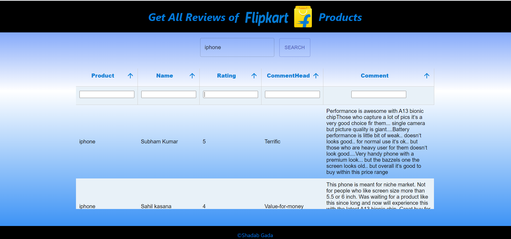
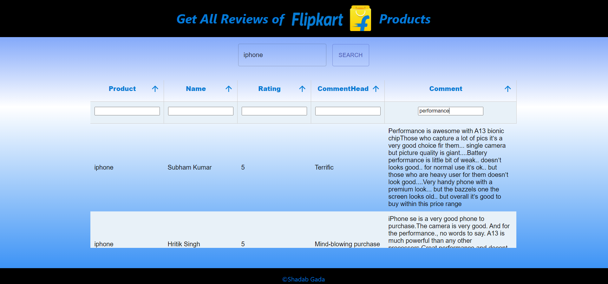
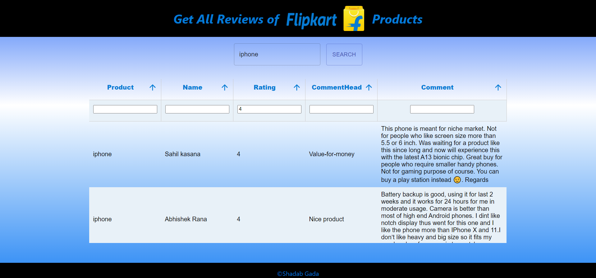
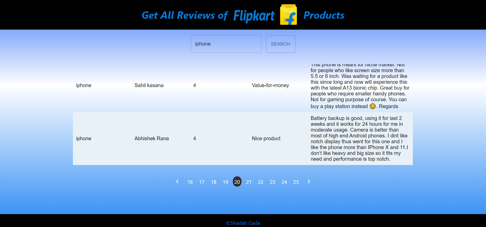

# Getting Started with Create React App

- This react-based user interface displays the reviews from Flipkart in a simple, clean, and readable way with an option to filter them on the basis of person name, rating, comment heading, and description
- There are thousands of reviews on Flipkart for some products and it becomes difficult to find specific reviews. This project helps to resolve this problem with the help of a single click
- Consumes a rest API from a Python flask-based scrapper project.
[Click here to access backend project](https://github.com/shadabgada/reviewScrapper)

## Available Scripts

In the project directory, you can run:

### `yarn start`

Runs the app in the development mode.\
Open [http://localhost:3000](http://localhost:3000) to view it in the browser.

The page will reload if you make edits.\
You will also see any lint errors in the console.

### `yarn build`

Builds the app for production to the `build` folder.\
It correctly bundles React in production mode and optimizes the build for the best performance.

The build is minified and the filenames include the hashes.\
Your app is ready to be deployed!

### `Screenshots`

HomePage

Filter By Comment keywords

Filter By Rating

Pagination

